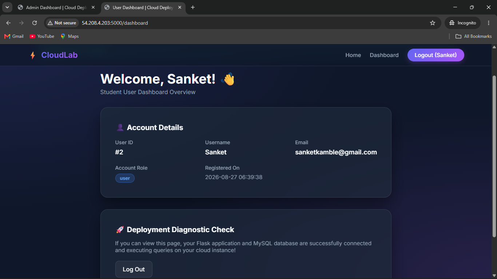
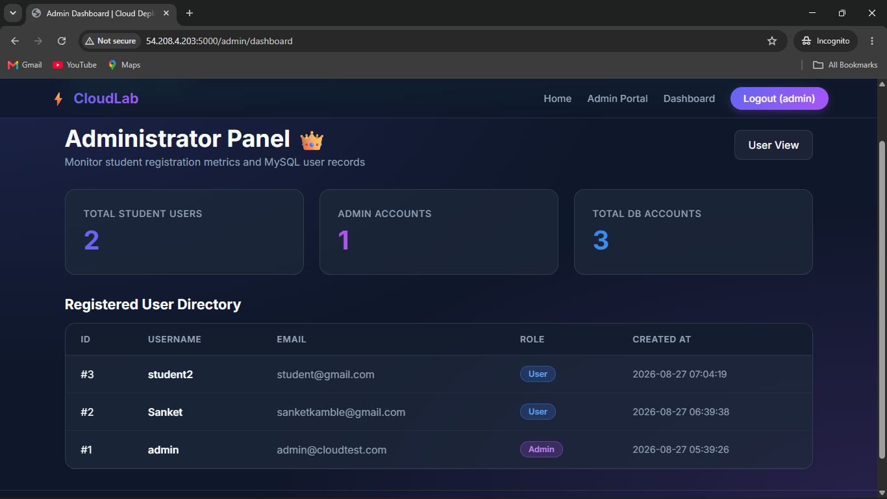

# Flask + MySQL AWS Deployment

A multi-tier Flask web application deployed on an AWS EC2 Ubuntu server with MySQL database integration.

This project was created as a Cloud Computing & DevOps practical project to demonstrate cloud deployment, database configuration, environment variables, authentication, password hashing, session management, and role-based administrator access.

## 🚀 Project Overview

The application provides a student-oriented web platform with:

- User registration
- User login
- Secure password hashing
- User dashboard
- Password reset
- Administrator login
- Role-based access control
- Administrator dashboard
- MySQL database integration
- Environment-based configuration
- AWS EC2 deployment

## 🏗️ Architecture

```text
                    Internet
                       |
                       v
                AWS EC2 Instance
                Ubuntu Linux
                       |
                       v
              Flask Web Application
                   Port 5000
                       |
                       v
                 MySQL Server
                   Port 3306
                       |
                       v
                cloud_test_db
                       |
                       v
                    users
```

## 🛠️ Technologies Used

| Technology | Purpose |
|---|---|
| Python 3 | Application development |
| Flask | Web framework |
| PyMySQL | MySQL connectivity |
| MySQL | Relational database |
| HTML/CSS | Frontend |
| Ubuntu Linux | Server operating system |
| AWS EC2 | Cloud deployment |
| Git | Version control |
| GitHub | Source code management |
| python-dotenv | Environment configuration |

## ✨ Application Features

### User Features

- User registration
- Username and email validation
- Secure password hashing
- User authentication
- Session management
- Protected user dashboard
- Account profile information
- Password reset functionality

### Administrator Features

- Dedicated administrator login
- Administrator authentication
- Role-based authorization
- Protected admin dashboard
- Total registered student users count
- Total administrator accounts count
- Registered user directory

## 🖥️ Application Screenshots

### User Dashboard

The deployed application provides a protected dashboard where authenticated users can view their account details and deployment/database status.



### Administrator Dashboard

The administrator dashboard provides role-protected access to registration metrics and the registered user directory.



## 🗄️ Database

### Database Name

```text
cloud_test_db
```

### Table

```text
users
```

### Users Table Structure

| Column | Description |
|---|---|
| id | Primary key |
| username | Unique username |
| email | Unique email |
| password_hash | Hashed password |
| role | user/admin |
| created_at | Account creation date |

## 🔐 Environment Configuration

Database credentials and application secrets are stored in environment variables rather than being hardcoded.

Example:

```env
MYSQL_HOST=localhost
MYSQL_PORT=3306
MYSQL_USER=root
MYSQL_PASSWORD=your_mysql_password
MYSQL_DB=cloud_test_db

SECRET_KEY=your_secret_key
FLASK_ENV=development
PORT=5000
```

The actual `.env` file is intentionally excluded from GitHub.

### Security

Never commit the following to GitHub:

- MySQL passwords
- Secret keys
- `.env` files
- AWS private keys
- SSH `.pem` files

## ☁️ AWS EC2 Deployment

The application is deployed on an AWS EC2 Ubuntu instance.

Flask is configured to listen on:

```text
0.0.0.0:5000
```

The live application was tested using the EC2 public IP:

```text
http://54.208.4.203:5000
```

> The EC2 public IP may change when the instance is stopped and started unless an Elastic IP is configured.

## 🔥 AWS Security Group

The EC2 Security Group allows the required inbound traffic.

| Type | Port | Purpose |
|---|---:|---|
| SSH | 22 | Server administration |
| Custom TCP | 5000 | Flask application |

For a production deployment, Flask's development server should be replaced with a production WSGI server and normally placed behind a reverse proxy.

## ⚙️ Installation

### 1. Clone the Repository

```bash
git clone https://github.com/sankya4323/flask-mysql-aws-deployment.git
cd flask-mysql-aws-deployment
```

### 2. Create a Virtual Environment

```bash
python3 -m venv venv
```

### 3. Activate the Virtual Environment

```bash
source venv/bin/activate
```

### 4. Install Dependencies

```bash
pip install -r requirements.txt
```

### 5. Configure Environment Variables

Create a `.env` file:

```bash
nano .env
```

Add your MySQL credentials and Flask configuration.

## 🗄️ MySQL Setup

Start MySQL:

```bash
sudo systemctl start mysql
```

Check MySQL status:

```bash
sudo systemctl status mysql
```

Login to MySQL:

```bash
mysql -u root -p
```

Create the database:

```sql
CREATE DATABASE cloud_test_db;
```

Select the database:

```sql
USE cloud_test_db;
```

Import the schema:

```bash
mysql -u root -p cloud_test_db < schema.sql
```

## ▶️ Run the Application

Activate the virtual environment:

```bash
source venv/bin/activate
```

Start the Flask application:

```bash
python app.py
```

The application runs on:

```text
http://0.0.0.0:5000
```

Access it from a browser:

```text
http://YOUR_EC2_PUBLIC_IP:5000
```

## 🔑 Administrator Account

For the practical demonstration:

```text
Username: admin
Password: admin123
Role: admin
```

> This credential is for practical demonstration only. Change the password before using the application in a real production environment.

## 🔍 Database Verification

Login to MySQL:

```bash
mysql -u root -p
```

Then:

```sql
USE cloud_test_db;

SELECT * FROM users;
```

To display usernames, email addresses, and roles:

```sql
SELECT username, email, role FROM users;
```

## 📂 Project Structure

```text
flask-mysql-aws-deployment/
│
├── app.py
├── config.py
├── requirements.txt
├── schema.sql
├── README.md
├── .gitignore
├── .env.example
│
├── static/
│   └── css/
│       └── style.css
│
├── templates/
│   ├── index.html
│   ├── login.html
│   ├── register.html
│   ├── dashboard.html
│   ├── admin_login.html
│   └── admin_dashboard.html
│
└── screenshots/
    ├── user-dashboard.png
    └── admin-dashboard.png
```

## 🔒 Git Security

The following should be excluded from Git:

```text
.env
venv/
__pycache__/
*.pyc
*.pem
```

The `.gitignore` file is used to prevent sensitive and unnecessary files from being uploaded.

## 🧪 Practical Demonstration

This project demonstrates:

1. MySQL installation
2. Database creation
3. Database schema initialization
4. Flask application configuration
5. Python virtual environment
6. Dependency installation
7. Environment variable configuration
8. User registration
9. User authentication
10. Password hashing
11. Session management
12. Protected user dashboard
13. Password reset
14. Administrator authentication
15. Role-based authorization
16. Administrator dashboard
17. AWS EC2 deployment
18. AWS Security Group configuration
19. Public web application access

## 📊 Evaluation Areas

| Area | Marks |
|---|---:|
| Database Setup | 20 |
| Application Configuration | 20 |
| User Features | 20 |
| Admin Features | 20 |
| Cloud Deployment | 20 |
| **Total** | **100** |

## 🎯 Project Objective

The primary objective of this project is to demonstrate the deployment of a database-backed Flask application on a cloud server while following basic DevOps practices for configuration, security, and version control.

## 👨‍💻 Author

**Sanket Kamble**

Cloud Computing & DevOps Practical Project

---

⭐ Flask + MySQL + AWS EC2 Deployment
